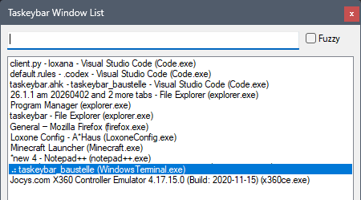
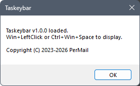

# Taskeybar

Taskeybar is a small window picker for Windows 11 users who miss a simple
vertical taskbar. Press `Win+Left Mouse Button` or `Ctrl+Win+Space` to open a
compact list of visible windows, then click a window to activate it.

Taskeybar is intentionally narrow: it is not a Windows shell replacement, a
taskbar customization framework, or a general window manager.



Read more:

- [Usage guide](docs/usage.md)
- [Customization from source](docs/customizing.md)
- [Changelog](CHANGELOG.md)

## Requirements

- Windows 11
- AutoHotkey v2 when running from source
- No installer or background service

## Install

Download `taskeybar.exe` from the latest GitHub release:

https://github.com/permail/taskeybar/releases/latest

Run the executable once. A message box confirms that Taskeybar is loaded and
ready.



To start Taskeybar automatically with Windows, add the executable to one of
Windows' normal startup locations, such as the Startup folder.

## Use

Press `Win+Left Mouse Button` to pop up Taskeybar near the pointer, or press
`Ctrl+Win+Space` to reopen it at its last keyboard-triggered position.

Start typing to filter the list. Use the arrow keys to move the selection,
`Enter` to activate it, `Ctrl+C` to copy the selected line, or click an entry
with the mouse. Press `Esc` or click the window `X` to close the list without
switching windows.

For the full behavior, feature rationale, and filtering modes, see
[docs/usage.md](docs/usage.md).

## Run From Source

Install AutoHotkey v2 and run:

```powershell
& 'C:\Program Files\AutoHotkey\v2\AutoHotkey.exe' taskeybar.ahk
```

The project is deliberately small: the application logic lives in
`taskeybar.ahk`. Contributor notes are in `CONTRIBUTING.md`. Common source
customizations are documented in [docs/customizing.md](docs/customizing.md).

## License

Taskeybar is licensed under the GNU General Public License v3.0 or later. See
`COPYING`.
