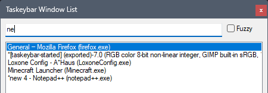

# Taskeybar Usage Guide

Taskeybar is a popup window list. It is meant to stay small, predictable, and
quick to dismiss.

## Two Triggers

Taskeybar has two fixed triggers because they support two different working
styles:

- `Win+Left Mouse Button`
  Use this when your hand is already on the mouse and you want the list to
  appear near the pointer.
- `Ctrl+Win+Space`
  Use this when you want a keyboard-only flow. Taskeybar reopens at its last
  keyboard-triggered position during the current run.

The mouse trigger does not overwrite the remembered keyboard position.

## Window List

Each list entry contains:

- the window title
- the executable name in parentheses

The list is sorted by executable name and then by window title. This keeps
windows from the same program near each other and makes repeated selection more
predictable than a constantly shifting MRU order.

## Filtering

Start typing immediately after Taskeybar opens. The filter field is focused by
default.

There are two filter modes:

- default mode
  The typed text must appear as one contiguous substring in the entry text.
  Use this when you already know part of the exact title or process name, such
  as `thunderbird`, `.md`, or `taskeybar.ahk`.
- `Fuzzy`
  The typed characters only need to appear in order. Use this when you want to
  type a quick abbreviation or when the matching text parts are separated, such
  as `tbird` or `tskbr`.

Taskeybar remembers the current filter text and `Fuzzy` checkbox state while
it is running.

## Activation And Navigation

- mouse click on a list entry
  Activates that window immediately.
- arrow keys
  Change the current selection without activating it.
- `Enter`
  Activates the selected window.
- `Ctrl+C`
  Copies the selected line exactly as shown. This is useful when you want to
  inspect or share the exact title and process combination.
- `Delete`
  Asks the selected window to close, just as its normal window `X` does.
  Taskeybar does not terminate the process, so the application can still ask
  you to save changes or cancel closing. Taskeybar stays open. After the window
  closes, the next matching entry remains selected at the same list position,
  making it quick to close several related windows in sequence. For example,
  filter for `Word` and press `Delete` repeatedly to close several Word windows.
  The target comes forward only while it needs to show a confirmation.

When possible, Taskeybar preselects the previously active window so repeated
switching between a small set of windows stays fast.

## Closing

Taskeybar closes without switching windows when you:

- press `Esc`
- click the window `X`

Taskeybar is intended to behave like a transient popup, not a permanent dock.

## In-App Help

Click the `?` button to show a compact reference for the keyboard controls and
filter behavior. The help is built into Taskeybar and does not open a browser.

## Window Size And Position

Taskeybar can be resized.

While the script is running, it remembers:

- current window size
- current filter text
- current `Fuzzy` state
- last keyboard-triggered position

The keyboard-triggered position is remembered independently from the mouse
trigger. This lets the keyboard flow feel stable even if you sometimes summon
Taskeybar with the mouse in a different part of the screen.

Long entries keep a horizontal scrollbar available. Widening the window is
often the fastest way to inspect long titles.
